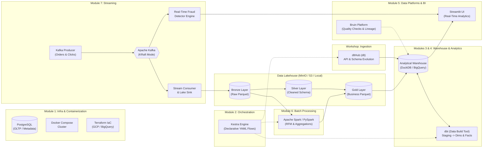

# OmniFlow — Enterprise E-Commerce Data Engineering Platform

[](https://python.org)
[](https://www.docker.com/)
[](https://kafka.apache.org/)
[](https://kestra.io/)
[](https://dlthub.com/)
[](https://www.getdbt.com/)
[](https://spark.apache.org/)
[](https://cloud.google.com/bigquery)
[](https://github.com/Ghaberitsohaib/omniflow-data-platform/actions/workflows/ci.yml)

> **OmniFlow** is a complete, production-grade end-to-end Data Engineering pipeline built according to the **DataTalksClub Data Engineering Zoomcamp** architecture. It ingests high-frequency real-time e-commerce transactions, clickstream events, and REST API catalogs, lands them in a partitioned Data Lake, orchestrates workflows, runs distributed batch aggregations, builds dimensional models with dbt, and surfaces executive analytics.

---

## Architecture Diagram



---

## Architectural Modules Breakdown

| Module | Component | Technology | Description |
| :--- | :--- | :--- | :--- |
| **Module 1** | Containerization & IaC | **Docker Compose**, **PostgreSQL**, **Terraform** | Orchestrates 7 services in isolated networks. Terraform provisions GCS Buckets & BigQuery datasets on GCP. |
| **Module 7** | Streaming | **Apache Kafka (KRaft)** | High-throughput e-commerce orders, clickstream events, and micro-batch lake sinks with snappy Parquet compression. |
| **Data Lake** | Storage | **MinIO (S3 API) / Local Lake** | Multi-tier lake architecture: `raw/`, `silver/`, `gold/` with date partitioning (`year=YYYY/month=MM/day=DD/`). |
| **Module 2** | Workflow Orchestration | **Kestra** | Modern declarative YAML flows (`orchestration/flows/`) with hourly and daily cron schedules and DAG dependencies. |
| **Workshop** | Data Ingestion | **dltHub (`dlt`)** | Automated extraction from external REST APIs (customers, products, currency rates) with schema inference & evolution. |
| **Module 3** | Data Warehouse | **Google BigQuery & DuckDB** | Dual-mode warehouse: 100% free local OLAP via DuckDB, seamlessly switchable to Google Cloud BigQuery. |
| **Module 6** | Batch Processing | **Apache Spark (PySpark)** | Distributed batch computation: RFM (Recency, Frequency, Monetary) customer segmentation, hourly & daily sales. |
| **Module 4** | Analytics Engineering | **dbt (data build tool)** | Clean staging views (`stg_*`), dimensional models (`dim_customers`, `dim_products`), fact tables (`fct_*`), and assertions. |
| **Module 5** | Data Platforms | **Bruin & Streamlit** | Bruin asset definitions & data quality checks. High-performance dark-themed Executive Analytics Dashboard. |

---

## Repository Structure

```
backend/
├── docker-compose.yml              # All services (Postgres, Kafka, MinIO, Kestra, Spark Master/Worker, Dashboard)
├── requirements.txt                # Python dependencies
├── .env.example                    # Environment configuration
├── terraform/                      # Module 1: Infrastructure as Code (GCP)
│   ├── main.tf                     # GCS Buckets & BigQuery Datasets
│   ├── variables.tf
│   └── outputs.tf
├── streaming/                      # Module 7: Kafka Streaming
│   ├── producer.py                 # Live transaction & clickstream generator (with fraud injection)
│   ├── consumer_to_lake.py         # Micro-batch sink writing partitioned Parquet to Data Lake
│   └── fraud_detector.py           # Real-time anomaly & high-risk transaction detection
├── ingestion/                      # Workshop: dltHub Ingestion
│   ├── dlt_pipeline.py             # Schema-inferring ELT with dlt
│   └── mock_api.py                 # REST API generator (Customers, Products, FX Rates)
├── orchestration/                  # Module 2: Kestra Orchestration
│   └── flows/
│       ├── 00_master_end_to_end.yml # Master DAG running all subflows
│       ├── 01_dlt_ingestion.yml     # Hourly dlt pipeline trigger
│       ├── 02_kafka_streaming.yml   # Kafka stream ingestion trigger
│       ├── 03_spark_batch.yml       # Daily Spark batch aggregator trigger
│       └── 04_dbt_analytics.yml     # dbt build & test trigger
├── batch/                          # Module 6: Batch Processing (Spark)
│   ├── spark_job_daily_metrics.py  # PySpark distributed batch job
│   └── run_batch.py                # Universal batch runner (PySpark / High-Speed Columnar)
├── analytics_dbt/                  # Module 4: Analytics Engineering (dbt)
│   ├── dbt_project.yml
│   ├── profiles.yml                # DuckDB, PostgreSQL, and BigQuery profiles
│   ├── models/
│   │   ├── staging/                # Staging views (stg_orders, stg_customers, stg_products)
│   │   ├── marts/                  # Dimensional & Fact marts (dim_*, fct_*)
│   │   └── schema.yml              # Data tests (unique, not_null)
│   ├── tests/
│   │   └── assert_positive_total_amount.sql # Singular dbt assertion
│   └── run_dbt.py                  # dbt runner & validation engine
├── data_platform/                  # Module 5: Data Platforms (Bruin + UI)
│   ├── bruin.yml                   # Bruin asset pipeline & quality checks
│   └── dashboard.py                # Streamlit Executive Real-time Dashboard
├── scripts/
│   ├── seed_data.py                # Seeds 30-day historical data
│   └── run_pipeline.py             # One-command full pipeline execution
└── README.md
```

---

## Quickstart Guide

### 1. Prerequisites
- **Python 3.11+**
- *(Optional for Containerized Mode)* **Docker Desktop**

### 2. Instant Local Execution (Zero-Setup / 100% Free)
You can run the entire pipeline immediately without waiting for cloud credits or Docker setup:

```bash
# 1. Install dependencies
pip install -r requirements.txt

# 2. Run the complete pipeline end-to-end
python scripts/run_pipeline.py
```

This command will:
1. Extract and normalize customers and catalog via **dltHub**.
2. Seed historical transactions and stream live orders into the **Data Lake** in partitioned **Parquet** files.
3. Compute distributed **RFM customer segments** and **daily metrics** via batch aggregation.
4. Execute **dbt** dimensional modeling (`dim_customers`, `dim_products`, `fct_daily_sales`, `fct_fraud_monitoring`) and pass data quality tests.
5. Execute the **real-time fraud detection engine**.

### 3. Launch the Executive Dashboard
```bash
streamlit run data_platform/dashboard.py
```
Open your browser at `http://localhost:8501`:
- **Real-Time Stream Simulation**: Click **"▶ Emit Live Kafka Events"** to simulate live transactions in real-time.
- **Analytics Marts**: Interactive Plotly charts for revenue trends, country breakdown, payment methods, and RFM tiers.
- **Fraud Monitoring**: Live feed of detected anomaly alerts.
- **Pipeline Controls**: One-click buttons to trigger dlt, Spark, or dbt.

---

## Dockerized Multi-Container Execution

To launch the full cluster with all UI consoles:

```bash
docker compose up -d
```

### Active Service Endpoints:
- **Kestra Orchestration UI**: [http://localhost:8080](http://localhost:8080)
- **Streamlit Analytics Dashboard**: [http://localhost:8501](http://localhost:8501)
- **Kafka Web UI**: [http://localhost:8085](http://localhost:8085)
- **MinIO Data Lake Console**: [http://localhost:9001](http://localhost:9001) (`minioadmin` / `minioadmin`)
- **Apache Spark Master Web UI**: [http://localhost:8082](http://localhost:8082)
- **PostgreSQL**: `localhost:5432` (`omni_admin` / `omni_secret_pass`)

---

## Deploying to Google Cloud (BigQuery & GCS)

To deploy the infrastructure to Google Cloud:

1. Authenticate with GCP:
   ```bash
   gcloud auth application-default login
   ```
2. Navigate to `terraform/` and apply:
   ```bash
   cd terraform
   terraform init
   terraform plan -var="gcp_project_id=YOUR_PROJECT_ID"
   terraform apply -var="gcp_project_id=YOUR_PROJECT_ID"
   ```
3. Update `analytics_dbt/profiles.yml` or `.env` with your project ID to target BigQuery directly.

---

## Dimensional Data Models (dbt)

```
raw_orders (Kafka Sink)  ───>  stg_orders  ───┐
                                              ├──>  dim_customers (Lifetime Value, Tiers)
ecommerce_raw.customers  ───>  stg_customers ─┘
                                              ├──>  dim_products (Margins, Inventory Health)
ecommerce_raw.products   ───>  stg_products  ─┘
                                              ├──>  fct_daily_sales (Revenue, AOV, Tax)
                                              ├──>  fct_customer_rfm (Recency, Frequency, Value)
                                              └──>  fct_fraud_monitoring (Risk Severity, Velocity)
```

---

## Key Highlights for Portfolio & Interviews
- **Hybrid Architecture**: Runs 100% locally with zero cloud costs (recruiters can clone and run in 5 seconds), while featuring full Terraform and BigQuery production configurations.
- **Modern 2025/2026 Stack**: Leverages the newest tools featured in DataTalksClub: **Kestra**, **dltHub**, **dbt**, **Kafka**, and **Bruin**.
- **Real-Time + Batch**: True Lambda/Kappa design handling both streaming event windows and historical bulk processing.
- **Enterprise Data Quality**: Built-in dbt assertions, primary key constraints, and Bruin data contracts.
